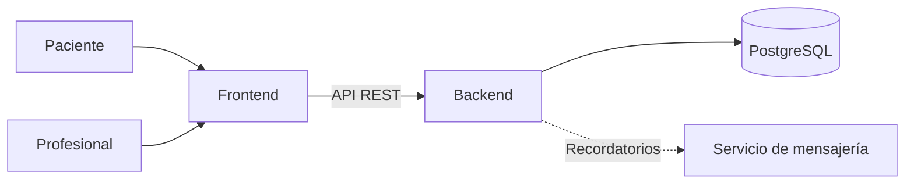
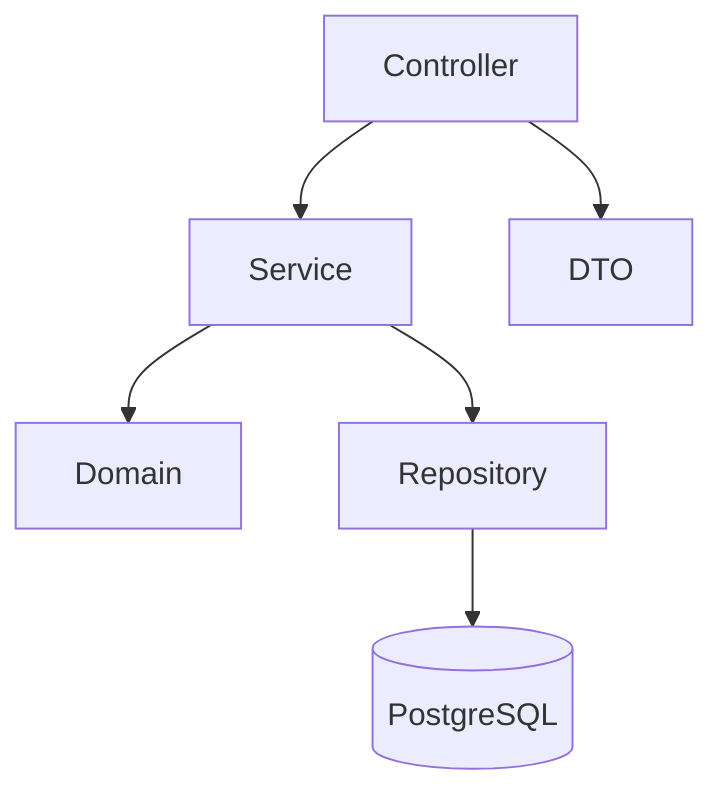

# Arquitectura del sistema

**Proyecto:** Sistema web de gestión de turnos para un consultorio podológico independiente  
**Grupo:** 155 — Ludueña / Mariasch  
**Tutor:** Sergio Andrés Antonini

## Arquitectura general

El sistema utiliza una arquitectura web cliente-servidor compuesta por tres componentes principales:

- **Frontend:** interfaz utilizada por el paciente y por el profesional.
- **Backend:** API REST que concentra la lógica de negocio.
- **Base de datos:** PostgreSQL para la persistencia de la información.

El frontend no accede directamente a la base de datos. Todas las operaciones se realizan mediante la API REST expuesta por el backend.



La integración con WhatsApp se considera un servicio externo al sistema principal.

Si la integración automática no resulta viable dentro del plazo del proyecto, se podrán consultar los recordatorios pendientes para realizar su envío manualmente.

---

## Backend

El backend se desarrollará con **Java, Spring Boot y Gradle**.

Será responsable de:

- exponer los endpoints de la API REST;
- autenticar al profesional;
- gestionar agenda y servicios;
- gestionar pacientes y turnos;
- calcular disponibilidad;
- validar excepciones de agenda;
- evitar turnos duplicados y solapamientos;
- calcular la hora de finalización de los turnos;
- controlar las transiciones de estado;
- gestionar recordatorios;
- acceder a PostgreSQL.

### Capas del backend

El backend se organizará por capas para separar responsabilidades.

| Capa | Responsabilidad |
| --- | --- |
| Controller | Recibe las solicitudes HTTP y devuelve las respuestas de la API. No contiene reglas de negocio. |
| Service | Contiene las reglas de negocio y coordina las operaciones del sistema. |
| Repository | Gestiona el acceso y las consultas a PostgreSQL. |
| Domain | Contiene las entidades principales y su comportamiento. |
| DTO | Define los objetos utilizados para la entrada y salida de datos de la API. |

### Relación entre capas



La capa `Controller` recibe las solicitudes de la API y delega las operaciones en `Service`.

`Service` contiene las reglas de negocio y utiliza las entidades del dominio y los repositorios necesarios para realizar las operaciones.

`Repository` se encarga del acceso a PostgreSQL.

Los `DTO` se utilizan para los datos de entrada y salida de la API, evitando exponer directamente las entidades internas del sistema.

---

## Frontend

El frontend se desarrollará con **React, TypeScript y Vite**.

La interfaz tendrá dos áreas principales.

### Reserva pública

Permite al paciente reservar un turno sin necesidad de crear una cuenta, iniciar sesión o validar su correo electrónico.

El flujo principal será:

**Servicio → fecha → horario → datos del paciente → confirmación del turno**

El paciente podrá:

- consultar los servicios disponibles;
- seleccionar un servicio;
- seleccionar una fecha;
- consultar horarios disponibles;
- ingresar nombre, apellido y teléfono;
- reservar un turno;
- aceptar opcionalmente recordatorios por WhatsApp.

### Administración

Será utilizada por el profesional y requerirá autenticación.

Permitirá:

- gestionar servicios;
- configurar días y horarios de atención;
- registrar excepciones de agenda;
- consultar pacientes;
- consultar el historial de turnos;
- confirmar turnos;
- cancelar turnos;
- reprogramar turnos;
- registrar turnos realizados;
- registrar ausencias;
- consultar recordatorios pendientes.

---

## Base de datos

La persistencia se realizará mediante **PostgreSQL**.

Las principales entidades son:

- `Profesional`
- `Agenda`
- `AgendaConfig`
- `ExcepcionAgenda`
- `Servicio`
- `Paciente`
- `Turno`

El esquema relacional se encuentra definido en:

[`database/schema.sql`](../database/schema.sql)

También se encuentra representado mediante:

- [`DER_Actualizado.md`](DER_Actualizado.md)
- [`Diagrama_Clases_Actualizado_V2_Entrega.md`](Diagrama_Clases_Actualizado_V2_Entrega.md)
- [`### Modelo de Datos (UML).md`](###%20Modelo%20de%20Datos%20%28UML%29.md)

---

## Reglas de negocio

Las principales reglas se implementarán en el backend y algunas estarán reforzadas mediante restricciones en PostgreSQL.

Entre ellas se encuentran:

- evitar turnos duplicados;
- evitar solapamientos entre turnos pendientes o confirmados;
- respetar los horarios configurados en la agenda;
- respetar las excepciones de agenda;
- verificar que el turno completo entre dentro de la franja disponible;
- calcular la hora de finalización a partir de la duración del servicio;
- permitir reprogramaciones únicamente para turnos `PENDIENTE` o `CONFIRMADO`;
- controlar las transiciones permitidas entre estados.

Los estados del turno son:

- `PENDIENTE`
- `CONFIRMADO`
- `CANCELADO`
- `REALIZADO`
- `AUSENTE`

Las transiciones permitidas son:

- `PENDIENTE` → `CONFIRMADO`, `CANCELADO`
- `CONFIRMADO` → `REALIZADO`, `AUSENTE`, `CANCELADO`

Los estados `CANCELADO`, `REALIZADO` y `AUSENTE` son terminales.

La base de datos refuerza estas reglas mediante el trigger `trg_turno_transicion_estado`.

---

## Manejo de fechas y horarios

Los turnos representan instantes concretos, por lo que sus fechas y horas se almacenan utilizando `TIMESTAMPTZ`.

En Java se representarán mediante `OffsetDateTime`.

Esto se aplica a:

- `Turno.fechaHoraInicio`
- `Turno.fechaHoraFin`
- `Turno.fechaCreacion`
- `Turno.fechaActualizacion`
- `Paciente.fechaCreacion`

En cambio:

- `AgendaConfig.horaInicio` y `AgendaConfig.horaFin` utilizan `LocalTime`;
- `ExcepcionAgenda.fechaInicio` y `ExcepcionAgenda.fechaFin` utilizan `LocalDate`.

Esto permite diferenciar los instantes reales de los horarios y fechas locales de atención.

---

## Recordatorios

Cada turno permite registrar:

- si el paciente aceptó recibir un recordatorio por WhatsApp;
- si el recordatorio ya fue enviado.

El backend podrá identificar los turnos próximos que necesiten un recordatorio.

Si se implementa una integración automática, el backend se comunicará con un servicio externo de mensajería.

Como alternativa para el MVP, se podrán mostrar los recordatorios pendientes para realizar el envío manualmente.

---

## Despliegue

La arquitectura prevista utiliza:

| Componente | Plataforma |
| --- | --- |
| Frontend | Vercel |
| Backend | Railway |
| Base de datos PostgreSQL | Railway |

La comunicación general será:

```text
Paciente / Profesional
        ↓
     Frontend
        ↓
     API REST
        ↓
      Backend
        ↓
    PostgreSQL
```

Las credenciales, conexiones y demás datos sensibles se configurarán mediante variables de entorno y no se almacenarán directamente en el repositorio.

---

## Tecnologías

| Componente | Tecnología |
| --- | --- |
| Backend | Java · Spring Boot · Gradle |
| Frontend | React · TypeScript · Vite |
| Base de datos | PostgreSQL |
| Comunicación | API REST |
| Frontend hosting | Vercel |
| Backend / PostgreSQL | Railway |

---

## Modelado

Durante la etapa de diseño se utilizaron herramientas de apoyo para revisar y refinar el modelo del sistema.

Los diagramas se mantienen en formato Mermaid, lo que permite modificarlos como texto y mantenerlos versionados dentro del repositorio.

El proceso realizado se encuentra resumido en:

[`MODELADO_CON_IA.md`](MODELADO_CON_IA.md)

---

## Documentación relacionada

- [`MODULOS.md`](MODULOS.md) — módulos del MVP y reglas de negocio.
- [`DER_Actualizado.md`](DER_Actualizado.md) — diagrama entidad-relación.
- [`Diagrama_Clases_Actualizado_V2_Entrega.md`](Diagrama_Clases_Actualizado_V2_Entrega.md) — diagrama de clases.
- [`### Modelo de Datos (UML).md`](###%20Modelo%20de%20Datos%20%28UML%29.md) — descripción del modelo.
- [`MODELADO_CON_IA.md`](MODELADO_CON_IA.md) — proceso de revisión y refinamiento del modelo.
- [`../database/schema.sql`](../database/schema.sql) — esquema PostgreSQL.