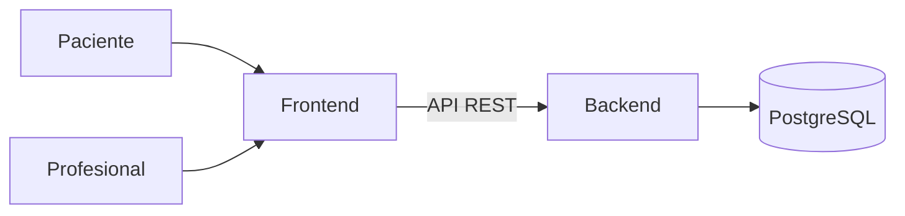

# Arquitectura del sistema

**Proyecto:** Sistema web de gestión de turnos para un consultorio podológico independiente  
**Grupo:** 155 — Ludueña / Mariasch  
**Tutor:** Sergio Andrés Antonini

## Arquitectura

El sistema tiene tres componentes separados: un frontend, un backend y una base de datos. El frontend y el backend se comunican únicamente por una API REST, de modo que ninguno conoce la implementación del otro.

### Capas del backend

El backend se organiza en capas, cada una con una sola responsabilidad:

| Capa | Responsabilidad |
| --- | --- |
| Controller | Expone los endpoints HTTP y traduce entre JSON y los objetos de la aplicación. No contiene reglas de negocio. |
| Service | Contiene las reglas de negocio: disponibilidad, solapamientos, cálculo de la hora de fin y validación de la matriz de transiciones antes de tocar la base. |
| Repository | Acceso a datos. Cada entidad tiene su repositorio con sus consultas contra PostgreSQL. |
| Domain | Las entidades y sus invariantes. Los detalles se agregan o se quitan con métodos de dominio, no desde los servicios. |
| DTO | Objetos de entrada y salida de la API. Las entidades no se exponen directamente. |

### Frontend

Interfaz web construida por componentes. La reserva pública es el único punto de entrada sin autenticación: el paciente llega, ve la disponibilidad y reserva, sin cuenta ni contraseña.

### Despliegue

El frontend se publica en Vercel y el backend junto con PostgreSQL en Railway. Como Railway corre en UTC, la forma de guardar las fechas y las horas tiene consecuencias: ver la decisión de zonas horarias en la [propuesta](Trabajo%20Final%20IntegradorV2.md).

## Tecnologías

Las tecnologías del sistema y la justificación de cada elección están en el [README](../README.md#tecnologías) y, en detalle, en el [§5 Stack tecnológico propuesto de la propuesta](Trabajo%20Final%20IntegradorV2.md).

## Decisiones del modelo de datos

Las decisiones sobre el modelo —transiciones de estado, vencimiento de reservas sin confirmar, zonas horarias y "última modificación, no auditoría"— están escritas en el [anexo de la propuesta](Trabajo%20Final%20IntegradorV2.md) y resumidas en la tabla de restricciones del [diagrama entidad-relación](DER_Actualizado.md). El esquema que las implementa está en [`database/schema.sql`](../database/schema.sql).
