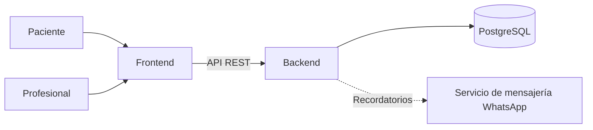

# Arquitectura del sistema

**Proyecto:** Sistema web de gestión de turnos para un consultorio podológico independiente  
**Grupo:** 155 — Ludueña / Mariasch  
**Tutor:** Sergio Andrés Antonini

## Arquitectura general

El sistema utiliza una arquitectura web cliente-servidor compuesta por tres componentes principales:

- **Frontend:** interfaz utilizada por el paciente y por el profesional.
- **Backend:** API REST que concentra la lógica de negocio.
- **Base de datos:** PostgreSQL para la persistencia de la información.

El frontend no accede directamente a la base de datos. Toda operación se realiza mediante la API REST expuesta por el backend.



La integración con un servicio de mensajería para WhatsApp se considera externa al núcleo del sistema. Si la integración automática no resulta viable dentro del plazo académico, el sistema permitirá consultar los recordatorios pendientes para realizar el envío manualmente.

---

## Backend

El backend se desarrollará con **Java, Spring Boot y Gradle**.

Será responsable de:

- exponer los endpoints de la API REST;
- autenticar al profesional;
- gestionar agenda, servicios, pacientes y turnos;
- calcular disponibilidad;
- validar excepciones de agenda;
- evitar superposiciones;
- calcular la hora de finalización de los turnos;
- controlar las transiciones de estado;
- gestionar recordatorios;
- acceder a PostgreSQL.

### Capas del backend

El backend se organizará por capas para separar responsabilidades.

| Capa | Responsabilidad |
| --- | --- |
| Controller | Expone los endpoints HTTP, recibe las solicitudes y devuelve las respuestas de la API. No contiene reglas de negocio. |
| Service | Implementa la lógica de negocio: disponibilidad, solapamientos, cálculo de la hora de finalización, reprogramación y validación de estados. |
| Repository | Gestiona el acceso y las consultas a PostgreSQL. |
| Domain | Contiene las entidades del dominio y el comportamiento asociado a ellas. |
| DTO | Define los objetos utilizados para la entrada y salida de información de la API, evitando exponer directamente las entidades de persistencia. |

El backend validará las reglas de negocio antes de persistir los cambios. La base de datos mantendrá además restricciones propias para proteger la integridad de los datos.

---

## Frontend

El frontend se desarrollará con **React, TypeScript y Vite**.

La interfaz tendrá dos áreas principales.

### Reserva pública

Permite al paciente reservar un turno sin necesidad de crear una cuenta, iniciar sesión o validar su correo electrónico.

El flujo principal será:

**Servicio → fecha → horario → datos del paciente → confirmación del turno**

El paciente podrá:

- consultar los servicios disponibles;
- seleccionar una fecha;
- consultar horarios disponibles;
- ingresar nombre, apellido y teléfono;
- reservar un turno;
- aceptar opcionalmente recordatorios por WhatsApp.

### Administración

Será utilizada por el profesional y requerirá autenticación.

Permitirá:

- gestionar los servicios;
- configurar la agenda;
- registrar excepciones de disponibilidad;
- consultar pacientes;
- consultar el historial de turnos;
- confirmar turnos;
- cancelar turnos;
- reprogramar turnos;
- registrar turnos realizados;
- registrar ausencias;
- consultar recordatorios pendientes.

---

## Base de datos

La persistencia se realizará mediante **PostgreSQL**.

Las principales entidades son:

- `Profesional`
- `Agenda`
- `AgendaConfig`
- `ExcepcionAgenda`
- `Servicio`
- `Paciente`
- `Turno`

El esquema relacional completo está definido en:

[`database/schema.sql`](../database/schema.sql)

El modelo se encuentra representado además en:

- [`DER_Actualizado.md`](DER_Actualizado.md)
- [`Diagrama_Clases_Actualizado_V2_Entrega.md`](Diagrama_Clases_Actualizado_V2_Entrega.md)
- [`### Modelo de Datos (UML).md`](###%20Modelo%20de%20Datos%20%28UML%29.md)

---

## Reglas de negocio

Las principales reglas se implementarán en la capa de servicios del backend y, cuando corresponda, estarán reforzadas mediante restricciones de PostgreSQL.

Entre ellas se encuentran:

- evitar turnos duplicados;
- evitar solapamientos entre turnos activos;
- respetar los horarios configurados en la agenda;
- respetar las excepciones de agenda;
- verificar que el turno completo entre dentro de la franja disponible;
- calcular `fecha_hora_fin` a partir de la duración del servicio;
- permitir reprogramaciones únicamente para turnos `PENDIENTE` o `CONFIRMADO`;
- controlar las transiciones permitidas entre estados.

Los estados del turno son:

- `PENDIENTE`
- `CONFIRMADO`
- `CANCELADO`
- `REALIZADO`
- `AUSENTE`

Las transiciones permitidas son:

- `PENDIENTE` → `CONFIRMADO`, `CANCELADO`
- `CONFIRMADO` → `REALIZADO`, `AUSENTE`, `CANCELADO`

`CANCELADO`, `REALIZADO` y `AUSENTE` son estados terminales.

La base de datos refuerza estas reglas mediante el trigger `trg_turno_transicion_estado`.

---

## Manejo de fechas y horarios

Los turnos representan instantes concretos, por lo que se almacenan utilizando `TIMESTAMPTZ`.

En Java se representarán mediante `OffsetDateTime`.

Esto aplica a:

- `Turno.fechaHoraInicio`
- `Turno.fechaHoraFin`
- `Turno.fechaCreacion`
- `Turno.fechaActualizacion`
- `Paciente.fechaCreacion`

El backend se configurará para trabajar de forma consistente con UTC durante el despliegue.

En cambio:

- `AgendaConfig.horaInicio` y `AgendaConfig.horaFin` utilizan `LocalTime`;
- `ExcepcionAgenda.fechaInicio` y `ExcepcionAgenda.fechaFin` utilizan `LocalDate`.

Estas propiedades representan horarios y fechas locales de atención y no un instante global.

---

## Recordatorios

Cada turno almacena:

- `acepta_recordatorio_whatsapp`
- `recordatorio_enviado`

El backend podrá identificar turnos próximos cuyos pacientes hayan aceptado recibir recordatorios.

Cuando se implemente una integración automática, el backend será el responsable de comunicarse con el servicio externo de mensajería.

Como alternativa para el MVP, podrán mostrarse los recordatorios pendientes para permitir su envío manual.

---

## Despliegue

La arquitectura prevista utiliza:

| Componente | Plataforma |
| --- | --- |
| Frontend | Vercel |
| Backend | Railway |
| Base de datos PostgreSQL | Railway |

La comunicación entre los componentes será:

```text
Paciente / Profesional
        ↓
     Frontend
        ↓
     API REST
        ↓
      Backend
        ↓
    PostgreSQL
```

Las credenciales, conexiones y demás datos sensibles se configurarán mediante variables de entorno y no deberán almacenarse directamente en el repositorio.

---

## Tecnologías

| Componente | Tecnología |
| --- | --- |
| Backend | Java · Spring Boot · Gradle |
| Frontend | React · TypeScript · Vite |
| Base de datos | PostgreSQL |
| Comunicación | API REST |
| Frontend hosting | Vercel |
| Backend / PostgreSQL | Railway |

La justificación de las tecnologías seleccionadas se encuentra desarrollada en la propuesta del proyecto:

[`Trabajo Final IntegradorV2.md`](Trabajo%20Final%20IntegradorV2.md)

---

## Documentación relacionada

- [`MODULOS.md`](MODULOS.md) — módulos funcionales y reglas de negocio.
- [`DER_Actualizado.md`](DER_Actualizado.md) — modelo entidad-relación.
- [`Diagrama_Clases_Actualizado_V2_Entrega.md`](Diagrama_Clases_Actualizado_V2_Entrega.md) — diagrama de clases.
- [`### Modelo de Datos (UML).md`](###%20Modelo%20de%20Datos%20%28UML%29.md) — descripción del modelo de datos.
- [`../database/schema.sql`](../database/schema.sql) — implementación del esquema PostgreSQL.