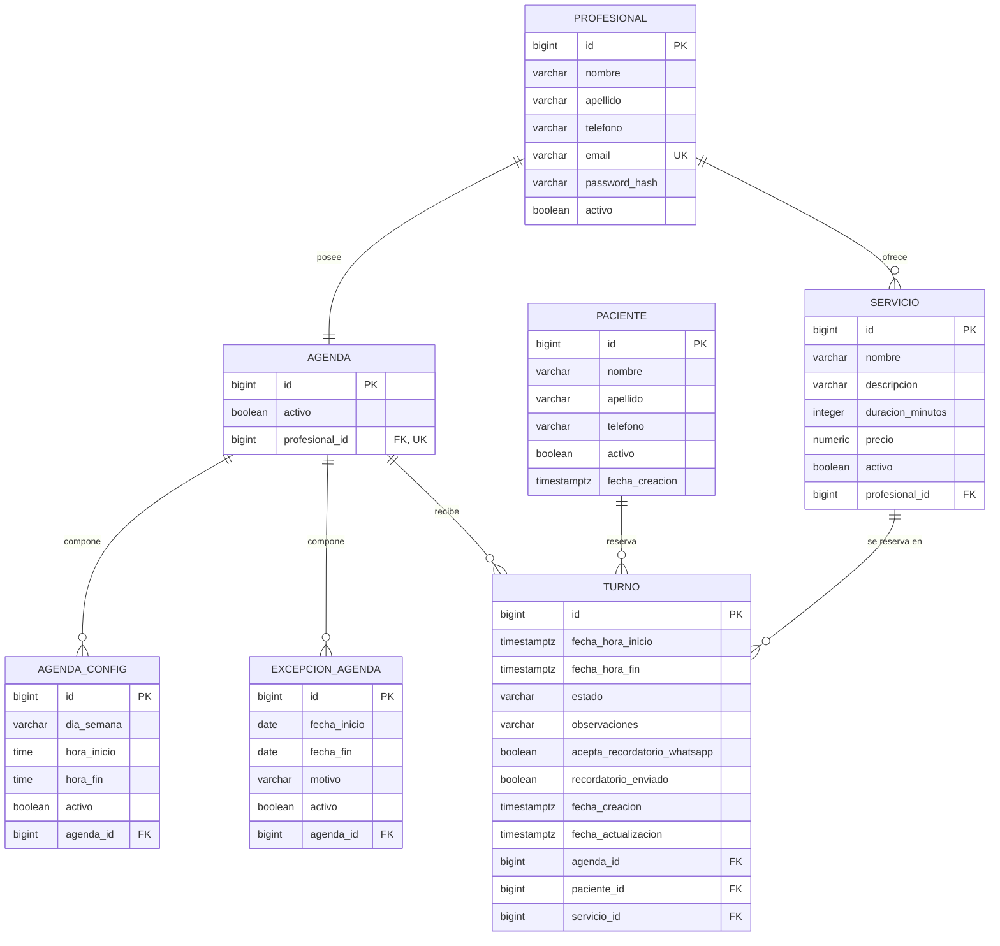

# DER — Diagrama entidad-relación (V2 Entrega)

Diagrama en sintaxis [Mermaid](https://mermaid.js.org). Se visualiza directamente en GitHub/GitLab, o
pegando el bloque en <https://mermaid.live>.

Generado a partir de `database/schema.sql`. Refleja el enum `EstadoTurno` con cinco estados, las columnas
de última modificación y el trigger `trg_turno_fecha_actualizacion`.

## Cardinalidad y reglas de integridad

* `PROFESIONAL` → `AGENDA`: exactamente una agenda por profesional. Lo garantiza el `UNIQUE` en
  `agenda.profesional_id`.
* `PROFESIONAL` → `SERVICIO`: un profesional ofrece varios servicios.
* `AGENDA` → `AGENDA_CONFIG` y `AGENDA` → `EXCEPCION_AGENDA`: composición. Un horario o una excepción
  sin agenda no tiene sentido, por eso `ON DELETE RESTRICT`. La configuración no referencia al
  profesional de forma directa: se llega a través de la agenda.
* `PACIENTE` → `TURNO`, `SERVICIO` → `TURNO`, `AGENDA` → `TURNO`: un turno referencia exactamente un
  paciente, un servicio y una agenda. La baja del paciente, del servicio o de la agenda con turnos
  asociados está bloqueada por `ON DELETE RESTRICT`; la baja lógica se hace con `activo = false`.
* La hora de fin del turno no se guarda calculada en la base: se deriva de
  `servicio.duracion_minutos` en el backend.

## Restricciones que no se ven en el diagrama

| Restricción | Definición |
| --- | --- |
| Horario del turno | `CHECK (fecha_hora_fin > fecha_hora_inicio)` |
| Estados del turno | `CHECK (estado IN ('PENDIENTE','CONFIRMADO','CANCELADO','REALIZADO','AUSENTE'))` |
| Turno activo único | `uq_turno_agenda_inicio_activo`, índice único parcial sobre `(agenda_id, fecha_hora_inicio)` cuando `estado IN ('PENDIENTE','CONFIRMADO')` |
| Franja horaria | `CHECK (hora_fin > hora_inicio)` en `agenda_config` |
| Rango de excepción | `CHECK (fecha_fin >= fecha_inicio)` en `excepcion_agenda` |
| Duración y precio | `CHECK (duracion_minutos > 0)` y `CHECK (precio >= 0)` en `servicio` |
| Última modificación | `trg_turno_fecha_actualizacion` actualiza `turno.fecha_actualizacion` en cada `UPDATE`. No es auditoría: no registra quién cambió ni qué |
| Transiciones de estado | `trg_turno_transicion_estado` (función `valida_turno_transicion_estado`) rechaza con `check_violation` todo cambio de estado fuera de la matriz |
| Vencimiento de reservas | `fn_cerrar_turnos_vencidos()` pasa a `CANCELADO` los `PENDIENTE` cuya `fecha_hora_fin` ya pasó, deja la constancia en `observaciones` y devuelve cuántos cerró |
| Zona horaria | `turno.fecha_hora_inicio`, `turno.fecha_hora_fin`, `turno.fecha_creacion`, `turno.fecha_actualizacion` y `paciente.fecha_creacion` son `TIMESTAMPTZ`. `agenda_config.hora_inicio/hora_fin` siguen siendo `TIME` y `excepcion_agenda.fecha_inicio/fecha_fin` siguen siendo `DATE` |
