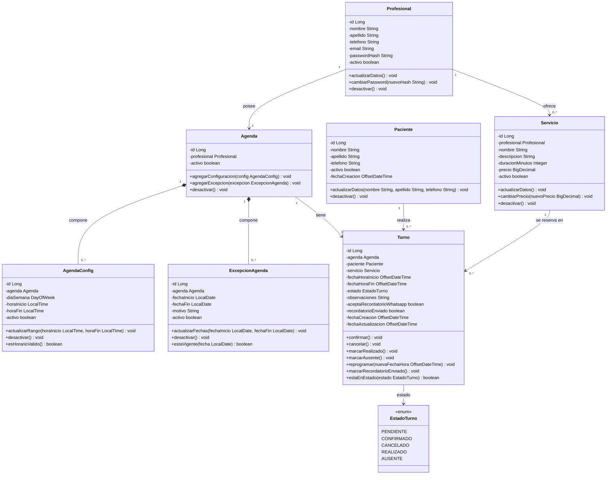

# Diagrama de clases — V2 Entrega

Diagrama en sintaxis [Mermaid](https://mermaid.js.org). Se visualiza directamente en GitHub/GitLab, o
pegando el bloque en <https://mermaid.live>.

Refleja el esquema de `database/schema.sql`: enum `EstadoTurno` con cinco estados y las columnas de
última modificación. `Turno.fechaActualizacion` se mantiene mediante el trigger
`trg_turno_fecha_actualizacion` definido en el mismo script.

Los cinco campos de fecha/hora de `Turno` y `Paciente` se tipan `OffsetDateTime` porque en la base son
`TIMESTAMPTZ`: son instantes reales y el despliegue corre en UTC. `AgendaConfig.horaInicio/horaFin`
(`LocalTime`) y `ExcepcionAgenda.fechaInicio/fechaFin` (`LocalDate`) se quedan sin zona a propósito,
porque describen un horario o un día local.

Los métodos de cambio de estado de `Turno` (`confirmar`, `cancelar`, `marcarRealizado`, `marcarAusente`)
sólo tienen éxito si la transición está en la matriz: `PENDIENTE → CONFIRMADO, CANCELADO` y
`CONFIRMADO → REALIZADO, AUSENTE, CANCELADO`. `CANCELADO`, `REALIZADO` y `AUSENTE` son terminales. La
base de datos lo garantiza con el trigger `trg_turno_transicion_estado`; `reprogramar` sólo aplica
mientras el turno esté en `PENDIENTE` o `CONFIRMADO`.

